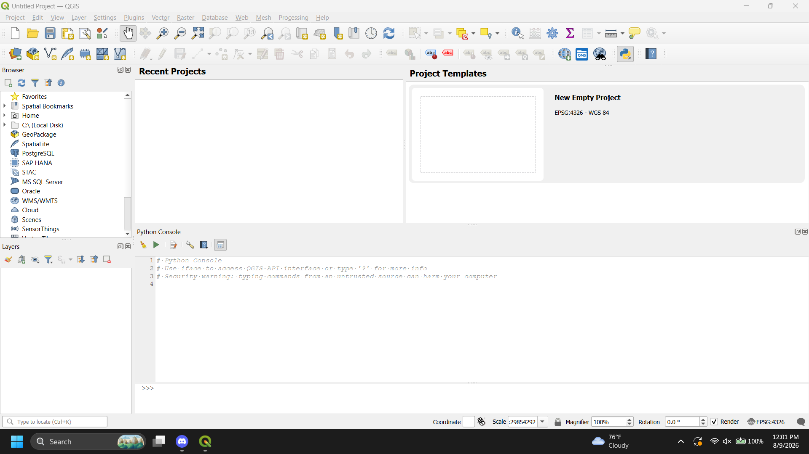

# Day 1 — Tuesday — August 9, 2026
**Candidate**: Garima Dhakal
**Work Structure**: [ Hybrid ] 

## 1. Morning Plan (09:00 – 09:30)

### Yesterday's Review
- **What I accomplished yesterday**: N/A
  - 
- **What I did not complete**: N/A
  - 
- **Why (if incomplete)**: N/A

#### Today's Target
- [x] Task 1: Read NepTrails overview and write summary
- [x] Task 2: Set up environment (tools, folders, Git, CRS)
- [x] Task 3: QGIS interface tour completed

- [x] Task 4: Created my_first.gpkg with 5 point features (name + elevation filled in)

# NepTrails Summary
NepTrails is a GIS-based travel-tech startup that maps and improves trail tourism in Nepal. Field teams collect spatial data using GPS devices, phones, and cameras during trail surveys. This raw data is then processed through a series of Python scripts inside QGIS, moving  from point data to stitched line data. Processed information is stored in GeoPackage(.gpkg) files and eventually synced with OpenStreetMap, whicch acts as a the mainn external database. Before anything is uploaded, a "Guarded Upload" system checks the data quality and can roll back changes if something goes wrong.

# Environment Setup Summary
Verified that Python, Git, PostgreSQL, QGIS, and VS Code were all installed and working. Created the project folder structure (data, logs, scripts, sops). Initialized a Git repository, made the first commit, and connected it to a GitHub repository (rima-gis/Garima-Intern). Also set QGIS's default CRS to EPSG:4326 in Settings so all new projects use it automatically.

## 2. Midday Status (After Break)
### Morning Session Review
- **Tasks completed this morning**:
  - Completed NepTrails overview summary and environment setup (Tasks 1 and 2)
- **Current blockers**:
  - None
- **Adjusted target for afternoon**:
  - Proceed with QGIS interface tour and creating first GeoPackage (Tasks 3 and 4)

## 3. End-of-Day Review (16:35 – 17:00)
### Tasks Completed Today
- [x] Task 1: Read NepTrails overview and wrote summary
- [x] Task 2: Set up environment (tools, folders, Git, CRS)
- [x] Task 3: QGIS interface tour completed
- [x] Task 4: Created my_first.gpkg with 5 point features

### Lessons Learned
- Learned how to connect a local Git repository to GitHub and push changes using git add, commit, and push
- Learned how to create a GeoPackage layer in QGIS and add point features with attributes
- Learned the difference between setting a CRS for a single project versus setting it as the global default

### SOP Created Today
- [ ] No → Reason: Day 1 was orientation and setup, no SOP was required yet

### Tomorrow's Plan
- Wait for Day 2 worksheet and continue with next assigned tasks